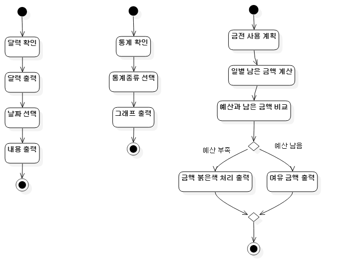

## MoneyRegister
***
>Diagram
***
>>1. UseCaseDiagram

***
>>2. ClassDiagram

***
>>3. ActivityDiagram
>>>3-1. password

>>>3-2. statistics

>>>3-3. deposit_withdraw

***
>>4. SequenceDiagram
>>>4-1. DataCheck

>>>4-2. InputOutput

>>>4-3. Login

>>5. StateChartDiagram

